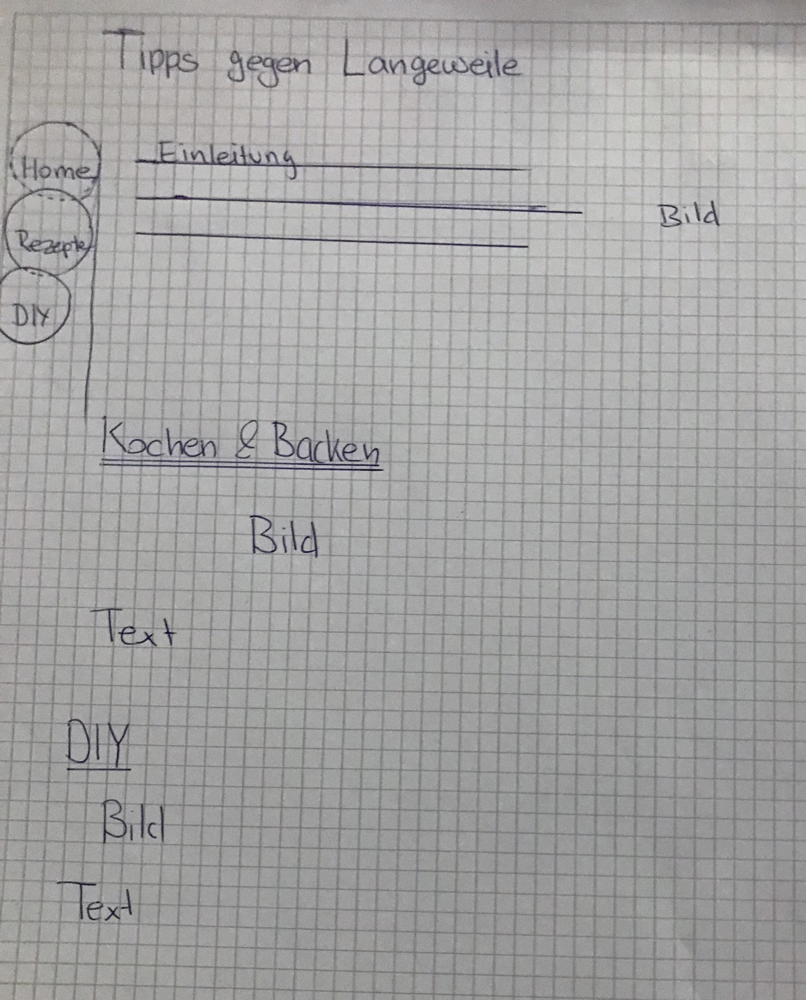
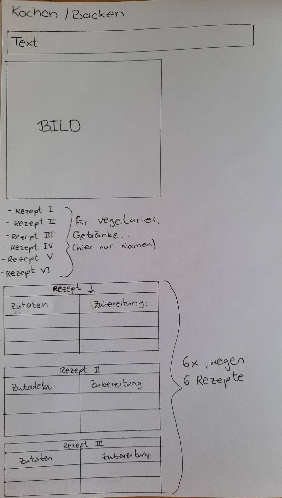
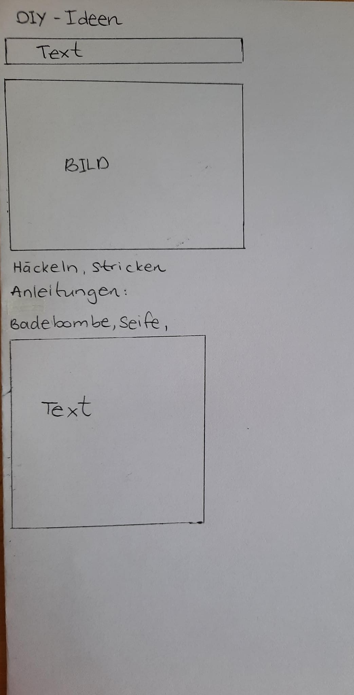
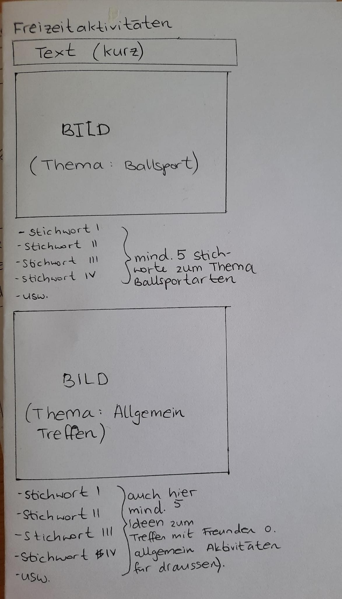

Tipps gegen Langeweile
 
Wir geben euch Tipps, wenn euch mal zu Hause langweilig ist. Ihr findet hier Rezepte, DIY-Ideen und auch Aktivitäten für draussen mit Freunden oder auch wenn ihr alleine seid. 
 
## Projektplan
 
Wir haben für euch verschiedene Ideen vorbereitet. Die Seite enthält Rezepte für Vegetarier sowie Fleischliebhaber. Es gibt auch erfrischende Getränke zum Nachmachen. Wenn ihr eher Lust auf Zeichnen oder eine Badebombe selber machen wollt, findet ihr hier eine Anleitung dafür. Wenn draussen schönes Wetter ist, könnt ihr euch auch mit Freunden treffen und viele verschiedene Ballsportarten lernen. 
 
### Hauptseite
 

Auf der linken Seite ist das Menu zu sehen. Home, Rezepte und DIY sollten in Kreisen dargestellt werden. Daneben ist die Einleitung und auf der rechten Seite ein Bild. Die Hauptseite besteht aus weiteren drei Bildern, die in der Mitte der Seite positioniert sind. Jedes Bild enthält ein Text mit Beschreibung. 
### Unterseite 1 (backen&kochen)
Diese Unterseite fängt mit einem kurzen Text an. Dann folgt ein Bild. Danach sind die Gerichte/ Getränke aufgelistet. Es sind 6 Rezepte, die Getränke sind oder Gerichte für Vegetarier oder Fleischliebhaber. Letzendlich sind die die Rezepte übersichtlich in einer Tabelle dargestellt worden. 
Skizze mit Beschreibung.
 
### Unterseite 2 (DIY)
Die Unterseite zeigt DIY Ideen zum selber machen. Als erstes kommt eine kurze Beschreibung. Dann folgt ein Bild zum Nachmachen. Wir haben dann eine Anleitung, um Seife sowie Badebombe selber zu machen, aufgeschrieben. 
 
### Unterseite 3(Freizeitaktivitäten)
Diese Unterseite haben wir erst später geplant. Hier haben wir einen kurzen Text, gefolgt von einem Bild zum 1. Thema: Ballsportarten. Dann haben wir Beispiele bzw. Ideen für das Thema aufgeschrieben. Genauso haben wir es zum zweiten Thema: Allgemeine Aktivitäten, gemacht. 
 
### Impressum
 
Skizze mit Beschreibung.
 
usw...
 
## Zeitplan
 
Zeitplan mit mindestens wöchentlichen Meilensteinen. Wann setzt wer etwas um?
 
| Deadline | Name | Beschreibung |
| --- | --- | --- |
| 12.05.2021 | Raazia Hussain, Shmekga Kalanathan | Banner und Menu machen |
| 13.05.2021 | Raazia Hussain, Shmekga Kalanathan | Text anfangen |
| 14.05.2021 | Raazia Hussain, Shmekga Kalanathan | Text weitermachen bzw. fertigmachen |
| 15.05.2021 | Raazia Hussain, Shmekga Kalanathan | Text fertigmachen  |
| 16.05.2021 | Raazia Hussain, Shmekga Kalanathan | Hauptseite anfangen |
| 17.05.2021 | Raazia Hussain | Hauptseite fertig gestalten |
| 18.05.2021 | Shmekga Kalanathan | Hauptseite fertig gestalten |
| 19.05.2021 | Raazia Hussain, Shmekga Kalanathan | Unterseite anfangen |
| 20.05.2021 | Raazia Hussain | Rezepte in der Unterseite schreiben |
| 21.05.2021 | Raazia Hussain, Shmekga Kalanathan | Unterseite fertig gestalten |
| 22.05.2021 | Raazia Hussain, Shmekga Kalanathan | Zweite Unterseite anfangen |
| 23.05.2021 | Shmekga Kalanathan | DIY- Ideen und Text in der Unterseite schreiben |
| 24.05.2021 | Raazia Hussain, Shmekga Kalanathan | zweite Unterseite fertig gestalten|
| 25.05.2021 | Raazia Hussain, Shmekga Kalanathan | Idee für dritte Unterseite finden |
| 26.05.2021 | Raazia Hussain, Shmekga Kalanathan | Skizze und Text der dritten Unterseite machen |
| 27.05.2021 | Raazia Hussain, Shmekga Kalanathan | 3 Unterseite fertiggestalten |
| 28.05.2021 | Raazia Hussain, Shmekga Kalanathan | Impressum umsetzen |
| 29.05.2021 | Raazia Hussain, Shmekga Kalanathan | Dokumentation schreiben |
| 30.05.2021 | Raazia Hussain, Shmekga Kalanathan | Dokumentation schreiben bzw. fertig machen |
 
## Umsetzung
 
Detaillierte Beschreibung der umgesetzten Webseite.
Wir konnten vieles von den Skizzen umsetzen. Auf der Hauptseite konnten wir das Menu nicht auf der linken Seite positionieren und konnten auch die Form davon nicht umsetzen. Das lag daran, dass wir es nicht geschafft hatten.Die Bilder sind auch nicht in der Mitte positioniert, wie ind er Skizze dargestellt, sondern auf der linken Seite. Auch die Struktur, dass nach dem Stichwort(Tipp) das Bild kommen sollte und und dann der Text, haben wir nicht eingehalten. Der Grund hierfür war, dass wir es andersrum besser fanden. Was wir umsetzen konnten war der obere Teil, wo das Bild auf der rechten Seite sein sollte und der Text daneben auf der linken Seite. 
Die Unterseite Kochen/ Backen wurde fast genauso wie ind er Skizze umgesetzt ausser, dass das Bild ganz unten befindet und nicht nach der kurzen Beschreibung. Auch das mit Freizeitaktivitäten haben wir ganz gut verwirklichen können. Der einzige Unterschied zur Skizze ist, dass wir keine Deskription haben, sondern nach dem Titel ein Bild positioniert ist. Die Unrerseite mit den DIY-Ideen wurde auch ganz gut übertragen. Wir haben aber hier kein allgemeines Bild genommen, sondern direkt ein Bild für Nachzeichnen. Danach haben wir paar Ideen zu Stricken und Häkeln gegeben, die wir in der Skizze nicht aufgelistet hatten. *Impressum fehlt*


 
### Hauptseite
 
Screenshot mit Beschreibung.
Die Hintergrundfarbe der Seite ist ... und das Menu...Das Menu befindet sich ganz oben. Auf der linken Seite ist ein Text, der beschreibt was diese Webseite für eine Funktion hat. Auf der rechten Seite ist ein Bild. Dann folgen jeweils in gleicher Reihenfolge zuerst 3 Tipps, die mit einem Text und einem passenden Bild dargestellt sind. Die Bilder sind jeweils auf der linken Seite positioniert. 
 
### Unterseite 1
 

Diese Unterseite fängt mit einer Deskription an. Dann folgen die Gerichte/ Getränke, die aufgelistet sind. Die Zubereitungen der Rezepte sind in einer Tabelle dargestellt. Zum Schluss ist noch ein Bild auf der linken Seite positioniert. 
 
### Unterseite 2

 
### Unterseite 3

Auf dieser Unterseite sieht man ganz oben ein Bild, dass sich fast über die ganze Seite erschreckt. Daraufhin sind Ballsportarten aufgelistet. Dann folgt ein Stichwort "Allgemein" mit einem Bild. Anschliessend haben wir Ideen für Aktivitäten mit Freunden, ohne Freunde und für draussen aufgeschrieben. 
 
### Impressum
 
Screenshot mit Beschreibung.
 
usw...
 
## Zusammenfassung
 
Zusammenfassung mit Vergleich zwischen Planung und Umsetzung. Was hat geklappt und was nicht? Konnte der Zeitplan eingehalten werden? Konnten die Skizzen umgesetzt werden?
 
Meistens konnten wir uns nicht nach unserem Zeitplan treffen. Das hat verschiedene Gründe. Unter anderem hatte eine von uns keine Zeit oder wir mussten für andere Fächer lernen. Ausserdem wollten wir jeden Tag an unserer Webseite arbeiten, aber das hatte doch  nicht funktioniert. Die Skizzen konnten wir relativ gut übertragen. Auf jeder Seite gab es kleine Unterschiede zur Skizze. Wir haben bei der Überstragung gemerkt, dass es anders schöner aussieht oder wir es doch nicht 
![brauchen]

---
 
Tipps zum README-Markdown:
- Eine Liste kann man einfach so schreiben
- Mit Rechtsklick auf `README.md`, `Open Preview` kann man eine Live-Vorschau des Textes sehen 
- So schreibt man *kursiv*, **fett** und beides ***fettkursiv***
- So kann man ein Bild einfügen: 
- So kann man einen Link einfügen [Linktext](https://google.com)
 
So kann `einzeiliger Code` eingefügt werden.
 
So kann mehrzeiliger Code eingefügt werden.
```
.test {​​​​​​​​
    background-color: blue;
}​​​​​​​​
```
 
- Weitere Hilfen gibt es hier: https://guides.github.com/features/mastering-markdown

